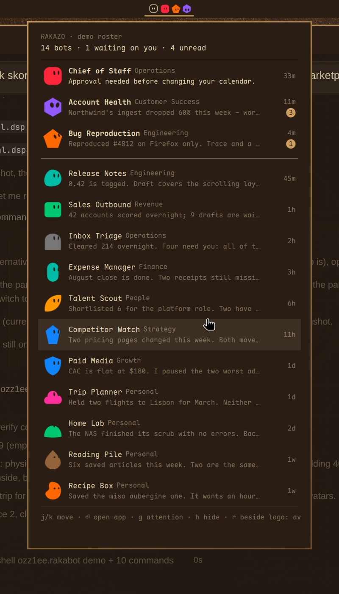
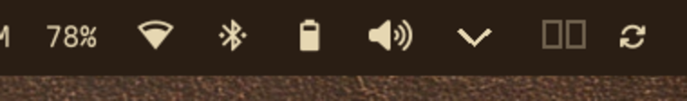

# Rakabot

Your [Rakazo](https://rakazo.com) roster in the [Omarchy](https://omarchy.org) bar.
Every bot is drawn as itself - the shape and colour it has in the app, or the
picture you gave it - wearing the face of whatever it wants from you.



The bar entry, on its own:



## What it does

- The Rakazo mark sits in the bar, dimmed when the server is not answering.
- Beside it, the bots waiting on you, as themselves. Nothing beside the mark means
  nothing needs you.
- Click for the panel: every bot and group, by section, with its title, its last
  message, how long ago it spoke and an unread badge.
- `waiting_input` and `waiting_takeover` runs read as *waiting on you* - those are
  the bots the bar shows first, oldest wait at the top, so nobody is buried.
- Picking a bot opens Rakazo where you already keep it: the window you have open
  (an Omarchy web app, the desktop app, or a browser), otherwise the web app
  launcher you installed, otherwise the browser. It never opens a second copy of
  a window that is already there - and when the window is already open, it also
  switches it to the bot you picked, through Rakazo's own command palette.

It only ever reads. Four procedures (`health`, `bots/list`, `botSections/list`,
`groups/list`) and nothing else - it never sends a message, answers an ask, stops a
run or marks a thread read. No traffic leaves your network except to your own
server.

## Install

```
omarchy plugin add https://github.com/ozz1ee-dev/omarchy-rakabot.git --enable
omarchy restart shell
```

Then point it at your server. This writes `~/.config/rakabot/config.json` and a
0600 token file, and signs in over Rakazo's own auth endpoint - the password is
typed at the prompt, never stored, never passed as an argument:

```
~/.config/omarchy/plugins/ozz1ee.rakabot/bin/rakabot-setup --url https://rakazo.example
```

Already have a token? `--token <token>`, or set `RAKABOT_TOKEN`. To prove a server
answers without writing anything, add `--check`.

Requirements: `python3`, `wtype` (for switching the open window to a picked bot)
and a Rakazo server you can reach (the plugin talks to it over whatever network you
already use, Tailscale included).

Remove with `omarchy plugin remove ozz1ee.rakabot`. It leaves behind
`~/.config/rakabot/` (your address and token) and
`~/.local/state/omarchy/rakabot/` (decoded avatar pictures) - delete both if you
want the credentials gone.

## In the bar

| | |
| --- | --- |
| click | open the panel |
| right-click | jump to Rakazo |
| middle-click | cycle what sits beside the mark |

The bar avatar order follows the panel: whoever has been waiting longest comes
first.

## In the panel

| key | |
| --- | --- |
| `j` `k` | move |
| `Enter` | open Rakazo |
| `g` | cycle the order: waiting first, by section, or purely by recency |
| `h` | redact names and messages, for sharing a screen |
| `r` | cycle what sits beside the mark |
| `Esc` | close |

## Settings

Set on the bar entry, or with the commands below:

```bash
omarchy bar set ozz1ee.rakabot barMetric count        # avatars - count - none
omarchy bar set ozz1ee.rakabot ordering channels      # attention - channels - flat
omarchy bar set ozz1ee.rakabot maxBarAvatars 4        # 1-6
omarchy bar set ozz1ee.rakabot groupBySection false   # one flat list
omarchy bar set ozz1ee.rakabot openWith web-app       # auto - web-app - browser
omarchy bar set ozz1ee.rakabot selectBot false       # raise only, do not switch
```

`openWith` decides what the click and the `Enter` key do: `auto` (default) focuses
an open Rakazo window, else launches the web app launcher you installed, else
opens the browser; `web-app` always opens a web app window; `browser` always opens
the browser.

`selectBot` (default on) makes picking a bot switch the open window to that bot.
Rakazo keeps the open bot in its address, but a running window cannot be navigated
from outside, so the switch goes through the app's own command palette (`Ctrl+K`,
the bot's name, `Enter`). It needs `wtype` and Hyprland, and nothing is typed
unless the Rakazo window is verifiably the focused one. Switch it off to only
raise the window.

`omarchy-shell ozz1ee.rakabot demo` swaps in a staged roster - fourteen invented
bots across two sections - for screenshots and for showing the thing off. Call it
again for the real one.

## Faces

A bot that wears a picture is drawn with it, masked to the same shape the app uses.
The rest get a face. Rakazo stores a shape and a colour, not an expression, so this
is Rakabot's reading of what a bot is doing:

| | |
| --- | --- |
| **eyes up, leaning in** | waiting on your answer |
| **wide-eyed** | more than one unread message |
| **head tilted** | one unread message |
| **half-closed, breathing** | nothing for a week |
| **level** | up to date |

A bot whose run is queued, leased or running says `thinking...` in place of its
last line.

## How it works

`bin/rakabot-watch` polls your Rakazo server over its own API - `POST /rpc/<name>`
with the session token as a bearer header - and streams a normalised roster as JSON
lines; `Widget.qml` renders it and `Avatar.qml` draws the bot, using Rakazo's own
palette and shape list so a bot looks here the way it looks there. Bots whose
colour carries no shape get the same shape the app would give them: the id hash is
reimplemented and pinned against the app's TypeScript in the test suite.

None of this is a documented contract. Rakazo is in beta and its API is its own; a
badge, an expression or a whole roster may go quiet after a server update, and
`bin/rakabot-watch` is the file to fix. The plugin is read-only by construction,
and it holds no cache of your roster.

## Credits

The visual design and the QML are derived from
[omabot](https://github.com/njpatel/omabot) by Neil Patel (Apache-2.0), retargeted
from Grok Bot's on-disk state to Rakazo's API. See `NOTICE`.

## License

Apache-2.0.
